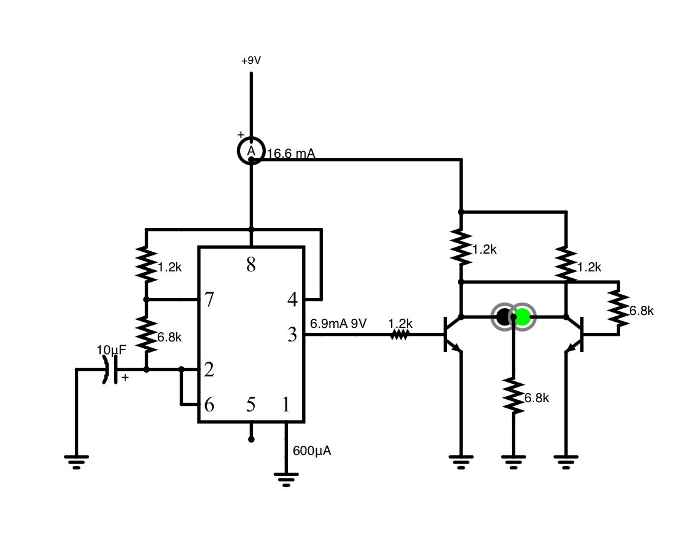

# Bi-color LED (three pin common cathode)

## Schematic

</img>

## Simulation

[https://www.falstad.com/circuit/circuitjs.html?ctz=CQAgjCAMB0l3BWEBmAHAJmgdgGzoRmACzICcpkORICkNIJNApgLRhgBQYOSV4OddJFT86xcNFTJk6ZEQEyiuHKiysw6DgCVw6EUREaRLGVDNE6pM3RgIOAd12G94UuidQHr90e9-IHABOKD5uIR5iQgGOfL5xLgEA5qIoyDgpyAjuNl5gYejo1AVFhShB4XnupvjpdCpwXtUI6Xw1ntxVWSBCImkiPd0gACZMAGYAhgCuADYALizTTEPg1lCwlFx4KKhFwigq3XvuIxMz84vLYtbrOI1dAzKCe9Hbu-rchyIBs91Y7sUhQSlK5sbDSWTySDSBAGI7QIRgLDELAEWiQIhEUjIVhWMBwYZjKZzDg-eQlahED4Aq62ZDEHikVAILCkKjSCAwKgs9B5IjoLEkQoQPF0E5E2YcZKPboWQGpWqeYLoP7dUptam6BqOdVq3XUF7Sh5CcC4TyOaWI9Jkk21crWy0MVrAkD1ALBC2mi0aMwaBrJSnpQp0APy6x2ql7EPsbKag3G6MMD4JpL7frNVOhnJCKxNdImf7p-XrOAQBDQHDSVCkJG0AxYOtrEs+yUgfPddNt6QKl6xFymXw96iVCphQftlpFVBfXIuXvOaeOXx8aV8ON1ahe7IcZBYSL6ecujdhxcCOXcOhd8CNA4PG-pzgAexNh-MkHI4BssA0SEEz+QHCAA](https://www.falstad.com/circuit/circuitjs.html?ctz=CQAgjCAMB0l3BWEBmAHAJmgdgGzoRmACzICcpkORICkNIJNApgLRhgBQYOSV4OddJFT86xEKmjlklXOjBZSMzgCVw6EURFgNIFsnRQjROqSN0YCDgHd123WFKGdIyDfBO7H557cAnFB9DAy8xITdbPhcvaLcAc1EUZBxE5ARDC3dHQ3R0alz8vJQOAJDswJB8FLocVDh3EKqQPia3bmD0yuEUWq6RQwATJgAzAEMAVwAbABcWSaYB8HMoWEhOdpRUfO7k-u7BkYmZuYWjCAtVzls0nJ2hPqgGrYeibge3acqsHKKDQSKxCsqFpaKhSKgdDJSFogVgiPJkFgsMgTCYCCkwHAQEMxlNphxPkQWkVXikCmc9FhoKgEGg4Tp0FRIOkEEgYJB0Eo8E4lLRSLRIMhwFicUd8Qk-pUTIE6MhkuYSl8fvkEGSAep6rYmuSdQCGvchCJJQpqvqxLgGFELf5LdQTbbKuravVSvd7cadGdwhwEqSpXQ-XLqo8An7DQw3uwMhqIjLwJ6-VHHhLejJqLsksG3EIzI1VXo8ylqOz4BAiNAiJWiAQiZBwQZqys4OdwD6Czl8-pgvLMpE7boyrpY1FPGVfO4WvmWqhXFldFEHEO5yI+JK+LG1+m3Z63Iiwpp7Cv0wrbNxZW6BJnW9deuGM61Fff8xm00ZnW4APbgLDNYsMOtmJiTY6GylTfsUQA)

## Breadboard

</img>

## Breadboard 2

</img>
